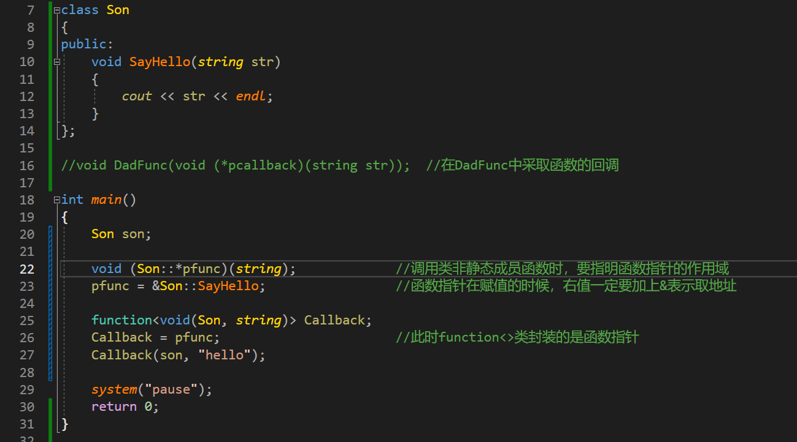

---
学习难点
---

## override关键字

https://zhuanlan.zhihu.com/p/260992059
https://zhuanlan.zhihu.com/p/624294602
eg:


## 内联函数

https://www.bilibili.com/video/BV1wj411Z7kW/?spm_id_from=333.337.search-card.all.click&vd_source=62fe42e71e56edada3fb7d905bdcf92b

1. 内联不call函数，而是直接在调用函数的地方展开汇编，不用在压栈出栈了。是一种以空间换时间的做法。
2. 内联只是给编译器的一个建议，编译器是否把这个函数归为内联是取决于编译器的设计的，一般的话递归不能内联，代码量小的函数频、繁调用的函数会设置为内联
3. 内联比宏函数好，好在有类型检查，还有可以调试，宏不能调试。（宏的缺点：不能调试，计算容易出错，没有类型检查）
4. 一般类的成员函数都是内联的， 比如构造 析构 赋值运算符重载
5. 内联会导致代码膨胀，就是打包的exe文件会比不用内联的大

## lambda表达式

基本格式：


### 变量捕获


注意此时N为按值捕获，只可访问不可修改
[=]：表示封闭范围内所有变量都按值捕获
[&]：表示封闭范围内所有变量都按引用捕获
[&, =N]：按值捕获N，其他变量按引用捕获
[this]：在类中使用匿名函数时，可以用该方法捕获当前实例对象的指针

## 智能指针

**（用于在一定程度上避免内存泄漏，属于模板类的应用）**

**下面四个都是指针，别搞混了**

eg:

    fun()
    {
        p=new type;
        return p;
    }
    p1=func();
    delete p1//此处如果不释放，就会导致内存泄漏，可以用智能指针解决


按理来说当p2=p1时，所有权已经转移到p2身上了，但我在cout<<*p1;时，程序不会报错，只有在运行时才会报错，所以auto_ptr被弃用

即用unique_ptr不允许两者之间的赋值操作，只允许通过move()转移所有权


### 引用计数变化的几种情况

1. 新创建对象时 +
2. 拷贝赋值时 +
3. 指针离开作用域时 -

### shared_ptr与内存泄漏

当有一个shared_ptr类型的指针a和指针b，两者互相指向对方，谁也释放不了谁，造成内存泄漏，记得可以自己写deleter来手动释放

weak_ptr属于弱指针，相对的，shared_ptr属于强指针

## 回调函数

https://www.bilibili.com/video/BV1vk4y1G7Hf/?spm_id_from=333.337.search-card.all.click&vd_source=62fe42e71e56edada3fb7d905bdcf92b

## 多线程与多进程

多线程适用于高并发，数据规模小且独立。多进程使用于稳定，数据规模大对并发没有那么高要求。io复用适用于大量客户端连接，需要大量的io监听文件描述符

## Qt中show()和exec()

### 窗口模式

要理清两个函数的区别，还需要理解窗口模式：

**模式窗口**：<font color=red>窗口会原地阻塞 </font>，只能操作该窗口，其余窗口不能再操作；只有关闭该窗口后，代码处才会获得返回值，阻塞停止，就可以操作其它界面了；

**半模式窗口**：<font color=red>窗口会原地伪阻塞 </font>，虽然也是只能操作该窗口，其余窗口不能再操作，但是代码会继续往下运行，所以说是伪阻塞；

**非模式窗口**：<font color=red>窗口不会阻塞 </font>，可以随意操作；

### exec()和show()的区别

| 函数1                                                               | 作用       |
| ------------------------------------------------------------------- | ---------- |
| QDialog* Dlg = new QDialog(this); Dlg->exec();                      | 模式窗口   |
| QDialog* Dlg = new QDialog(this); Dlg->setModal(true); Dlg->show(); | 半模式窗口 |
| QDialog* Dlg = new QDialog(this); Dlg->show();                      | 非模式窗口 |

**应用场景：**

1. new出来了一个新界面，需要用exec()，保证界面能一直显示
2. 没有新界面，但是有connect函数，需要用exec()，因为connect不一定会在注册之后就立刻连接，所以需要进入事件循环
3. 在重写子线程的run()方法时，也需要加入exec()进入事件循环，保证run能执行完毕

## 设计模式

https://zhuanlan.zhihu.com/p/431714886
[C++设计模式_毕加索来喽的博客-CSDN博客](https://blog.csdn.net/weixin_42636062/category_11313224.html?spm=1001.2014.3001.5482) 

### 工厂模式

对于工厂模式来说，都用到了动态多态，这样我们在使用的时候可以让代码有更高的复用性，不需要指定我想用的具体是哪个子类，只需要同一写成其父类，用的时候再传入具体子类即可

[3.C++设计模式-创建型模型_设计模式-构建模式c++_毕加索来喽的博客-CSDN博客](https://blog.csdn.net/weixin_42636062/article/details/119938514)  

[C++设计模式——单例模式_单例模式c++_静思心远的博客-CSDN博客](https://blog.csdn.net/zhiyuan2021/article/details/108032795)

#### 简单工厂模式

我要创建具体对象的时候，往工厂里传入对应字符串，然后在工厂的Create函数中通过ifelse返回对应创建的对应对象，main.cpp中代码如下：


显然，我要添加新的水果时，首先要创建一个继承于AbstractFruit的具体水果类，然后在FruitFactory的CreateFruit中添加新建具体水果类的ifelse语句。
特点：

1. 在Fruit类中包含很多“if…else…”代码块
2. Fruit类的职责过重
3. 当需要增加新类型的水果时，必须修改Fruit类的源代码

#### 工厂方法模式

其实和简单工厂模式相似，只不过在工厂方法模式中的核心工厂类不再创建具体水果对象，而是把这项工作推迟到了其子类中。main.cpp中具体代码如下：


显然，我需要添加新的水果时，首先要创建一个继承于AbstractFruit的具体水果类，然后创建一个继承于AbstractFruitFactory的具体水果工厂类。
特点：  

1. 在添加新水果时不用修改源代码
2. 添加新水果时需要单独创建一个类，代码量大

#### 抽象工厂模式

与工厂方法模式类似，但抽象工厂抽象的是整个产品族而非具体的产品。比如在工厂方法模式中我只要创建苹果，香蕉，鸭梨，但在抽象工厂模式中，这些水果还分不同的产地，比如中国苹果，美国苹果，日本苹果。main.cpp 中具体代码如下：


显然：
1. 我只需要添加产品族时，只需要创建一个继承于抽象工厂的具体工厂类，然后创建继承于抽象工厂具体产品类 的 具体工厂具体产品类。
2. 当我需要为产品族添加具体产品时，需要先创建一个新的 抽象工厂具体产品类 然后再创建继承于 抽象工厂具体产品类 的具体工厂具体产品类 ，最后在抽象工厂中创建 创建抽象工厂具体产品方法（纯虚函数） ，在具体工厂中创建 创建具体工厂具体产品方法

特点：
1. 新增产品族时很方便，不用修改已有的代码
2. 新增具体产品时很复杂，需要修改抽象工厂和具体工厂的源码

### 单例模式

**单例模式理论：**

单例模式是一种常用的软件设计模式。在它的核心结构中只包含一个被称为单例的特殊类。通过单例模式可以保证系统中一个类只有一个实例而且该实例易于外界访问，从而方便对实例个数的控制并节约系统资源。如果希望在系统中某个类的对象只能存在一个，单例模式是最好的解决方案。

**实现单例步骤：**
1. 构造函数私有化
2. 增加静态私有的当前类的指针变量
3. 提供静态对外接口，可以让用户获得单例对象(GetInstance)

#### 单例模式（懒汉式）

**需要时才会创建**


#### 单例模式（饿汉式）

**直接创建，即在main执行前就创建好了**


#### 单例模式的线程安全问题

对于饿汉式而言，因为创建对象在main函数执行之前，所以不会出现线程安全问题

对于懒汉式而言，由于会在需要时才创建对象，所以会出现线程安全问题 
解决办法：加入双检锁-DCL机制

对于此机制的理解：
假设此处有两线程A，B。A在执行完第一个判空语句进入Lock()时正好时间片结束，轮到B进入相应的时间片；显然，此时对于该进程而言，单例对象还没创建，所以B顺理成章地创建单例对象；问题出在当B的时间片结束，进入A的时间片时，如果没有加入双检锁机制，进入Lock()后不会再次判断进程中是否已经存在单例对象，所以顺理成章地再次创建单例对象，那么此时该进程中存在了两个单例对象，线程不安全；如果加入了双检锁机制，则A在创建对象前会再次检测单例对象是否存在，延迟了单例对象创建时间，保证线程安全。但此操作由于加入了两个判断语句，所以消耗时间稍长，所以如果对性能要求比较高的话，应该使用饿汉式。

#### 单例模式的对象释放问题

1. 单例对象从头到尾就一份内存，没必要释放
2. 如果非要提供释放，可以如下，运行完自动释放：

```c++
#include <iostream>
using namespace std;

//实现单例步骤
//1.构造函数私有化
//2.增加静态私有的当前类的指针变量
//3.提供静态对外接口，可以让用户获得单例对象

//单例 分为懒汉式 饿汉式

//1.懒汉式(需要的时候才会创建)
class Singleton_lazy {
private:
	Singleton_lazy() { cout << "我是懒汉构造！" << endl; }
public:
	static Singleton_lazy* getInstance() {
		if (pSingleton == NULL) {
			pSingleton = new Singleton_lazy;
		}
		return pSingleton;
	}
#if 0 
	//这样释放不行，万一谁手贱释放，就直接没了，这个权限不能给
	static void freeSpace() {
		if (pSingleton != NULL) {
			delete pSingleton;
		}
	}
#endif
	//如果非要写，可以加个类中类，运行完自动释放
	class Garbo {
		~Garbo() {
			if (pSingleton != NULL) {
				delete pSingleton;
			}
		}
	};

private:
	static Singleton_lazy* pSingleton;
	//创建的静态变量位于全局区，等程序结束之后由系统自动释放，
    //释放时调用garbo的析构函数，正好释放该单例对象
	static Garbo garbo;
};

//类外初始化
Singleton_lazy* Singleton_lazy::pSingleton = NULL;

```

## QComboBox

想设置combobox的下拉列表必须这样设置：

注意事项&代码解释：


## 架构模式

### 分层模式


**操作系统：**
操作系统内核 -> Shell+各种库 -> jvm/python的runtime ->常见的应用层，各种框架 -> 应用
**通信协议：**

### C/S模式


只要是个联网软件，就交C/S模式

### 主从模式


### 管道模式


**函数调用链：（C++中的链式编程思想）**
	比如说A.B.C.D，在C++里最常见的是cout<<"hello world!"<<endl;返回ostream&；或者说++(++i);返回i的数据类型的引用；需要注意的是用链式编程思想需要返回当前对象的引用，不过对于后置++来说，由于是要延迟++，返回的是局部变量，不能返回引用，所以不能使用链式编程思想。

### 消息传递模式


**任务队列：**	

任务队列是一种用于存储和执行异步任务的机制。它通常由三个部分组成：任务定义、任务队列和任务执行者。任务定义包括任务的定义、任务如何进入队列以及任务队列的调度执行。任务队列是一个维持一系列任务的容器，它需要一个用于存放任务的名字/任务的类型/任务所需要的参数/任务本身这些数据的介质，这就是store。任务执行者的角色一般是独立的，它按照一定的顺序来执行一个任务，在任务完成/任务出错/任务超时这些情况之后，执行下一个任务，直到所有任务清空之后，当前队列开始空转，但是依旧不会停止。任务队列和消息队列有所不同，任务队列提供了执行任务所需的功能，比如任务的重试、结果的返回、任务状态记录等，而消息队列更侧重于消息的吞吐、处理，具有有处理海量信息的能力

以下是一些任务队列的使用场景：

**异步处理：**任务队列可以用于处理那些不需要立即在当前请求下执行的任务。
**应用解耦：**任务队列可以帮助解耦应用程序，将一些独立的任务从主流程中分离出来，提高应用程序的可维护性和可扩展性。
**流量削锋：**任务队列可以用于处理突发的高并发请求，通过将请求放入队列中，逐渐处理，避免系统过载。
**消息通讯：**任务队列可以用于在不同的系统之间传递消息，实现系统之间的解耦和通信。

### event-bus模式


消息传递模式是1对1的，而event-bus模式是1对多的。

**Fixppo中的消息传递方式：**

在Fixppo中，他的中间介质就是 MgrView ，消息发布者就是MgrView管理的ui界面，消息接收者就是MainView，属于消息传递模式。因为如果是event-bus模式的话，那对于MgrView来说，应该有很多接收者都可以接受他的消息。但实际情况是，只有MainView能接受他的消息，也就是说这个消息传递实际上是点对点的，（该情况和connect非常相似，可以接着往下看）而且由于消息是单向传递的，所以sender不知道receiver是谁，但receiver必须知道sender是谁，这样才能正常通信。

#### event-bus模式与消息传递模式的区别


#### Qt中的connect


在Qt中，你可以使用事件总线（Event Bus）模式的思想来实现一种类似的机制，尽管Qt没有直接提供称为“事件总线”的特定组件。Qt的信号和槽机制通常用于处理组件之间的通信，但你可以使用自定义的事件类和QCoreApplication的`postEvent`和`sendEvent`函数来模拟事件总线。

网上说connect是消息传递模式，我觉得有道理，因为connect中没有做到消息发布者和接收者完全解耦（接收者还是得知道消息是哪里发出来的），而从实现方式上来说，event-bus是靠注册事件实现的，这个和connect的原理比较类似

#### event-bus模式在Qt中的应用

以下是如何在Qt中应用事件总线模式的示例：

1. **自定义事件类**：首先，你可以创建一个自定义的事件类，用于表示不同类型的事件。这个事件类应该继承自`QEvent`类或其子类。

```
cppCopy codeclass MyCustomEvent : public QEvent
{
public:
    MyCustomEvent(Type type) : QEvent(type) {}
    // 可以添加自定义的数据成员或方法
};
```

1. **事件总线类**：创建一个事件总线类，它负责管理事件的发布和订阅。

```
cppCopy codeclass EventBus : public QObject
{
    Q_OBJECT

public:
    static EventBus* instance() {
        if (!m_instance) {
            m_instance = new EventBus();
        }
        return m_instance;
    }

    void publishEvent(QEvent* event) {
        QCoreApplication::postEvent(this, event);
    }

signals:
    void customEventReceived(MyCustomEvent* event);

private:
    EventBus() {}

private:
    static EventBus* m_instance;
};
```

1. **事件的发布和订阅**：组件可以订阅事件总线中感兴趣的事件，并在事件发生时响应它们。

```
cppCopy code// 在组件中订阅事件
EventBus::instance()->connect(EventBus::instance(), &EventBus::customEventReceived, this, &MyComponent::onCustomEventReceived);

// 在组件中发布事件
MyCustomEvent* event = new MyCustomEvent(QEvent::User);
EventBus::instance()->publishEvent(event);
```

通过这种方式，你可以在Qt中实现事件总线模式的一种简化版本，以实现组件之间的解耦通信。这种模拟事件总线的方法可以用于应对各种应用场景，包括Qt应用程序中的模块间通信、UI组件之间的通信、或者处理自定义事件。

### 点对点模式


### MVC模式


[超详细的！！！MVC架构模式说明 - 知乎 (zhihu.com)](https://zhuanlan.zhihu.com/p/417635345)


### 观察者模式


## 函数指针和回调函数


### 申明函数指针


- 其中fun1，fun2，fun3虽然函数名和形参名不一样，但都是相同类型的函数；由此可得fun4, 5和fun1，2，3都不是同一类型函数

- 如果要申明以上三种函数的函数指针，则语法如下：

  int (*pFuncA)(int, string);

  bool (*pFuncB)(int, string);

  bool (*pFuncC)(int);

  **注意：**

  1. 函数指针的返回值要与原函数相同。
  2. 第一个括号内为函数指针名，必须用括号括起来，并且指针名前面要加*。
  3. 参数列表中的参数类型必须与原函数一样，但参数名可写可不写。
  
- 函数指针的实践：

  

### 函数回调

#### 普通函数的函数回调


  理解：

  现在我要开发一个方便大伙表白的函数，这个函数名叫做表白神器，在这个函数里干三件事。1. 表白之前的场地布置等准备活动。2. 表白时的动作以及我对女生说的话。3. 表白之后的场地打扫等收尾活动。在这三件事情中，第1，3条都是可以确定的事情，只有第2件事情不确定，因为每个人的做法都不一样，这个时候就可以用到函数指针，那么用户在调用表白函数时只需要传入自己准备好的个性化表白函数指针，即可有一个完整的表白流程。这种函数调用的方法就叫函数的回调，其中个性化表白函数就叫回调函数。

  **对于回调函数需要注意两点：**（在和普通函数调用对比之后，我注意到两点不同的地方）

  1. 在表白神器中不能直接调用个性化表白函数，因为不同的用户有不同的个性化表白函数，我根本不知道这个表白神器具体被谁调用。
  2. 采用函数指针传参的形式，使不同用户在调用同一个表白神器时，可以根据自己的情况调用不同的个性化表白函数，使函数整体的灵活性更强。
  3. 很明显，通过以上2点，对于我的需求而言，我只能使用回调函数来实现

  **回调函数的传参方式：**

  1. 由调用者函数提供实参

     

  2. 由外界提供实参

     

#### 类成员函数的函数回调

[关于C++ 回调函数(callback) 精简且实用_c++回调函数_zhoupian的博客-CSDN博客](https://blog.csdn.net/zhoupian/article/details/119495949)

##### 静态函数


##### 非静态函数

**std::function：**

function<>的实例对象封装各种可调用的实体，包括函数指针，lambda表达式，类的成员函数，普通函数

[C++11中的std::function_std::function 大小__大猪的博客-CSDN博客](https://blog.csdn.net/u013654125/article/details/100140547)

封装类的非静态成员函数：


封装函数指针：



**std::bind**

bind用来绑定函数的某些参数的，在函数的回调之中，可以用来将 类的非静态成员函数 中的第一个参数与具体对象绑定，但注意对于参数列表中的剩余参数，必须显示指明或者用placeholders::_1 / _2 / _3……指定。他的返回值是一个可调用的实体，可以选择用function<>接受

[C++11中的std::bind__大猪的博客-CSDN博客](https://blog.csdn.net/u013654125/article/details/100140328)

使用bind配合function实现函数的回调（耦合度低）


使用function<>实现函数的回调（耦合度高）


## connect的原理

[Qt中的信号槽 | 爱编程的大丙 (subingwen.cn)](https://subingwen.cn/qt/qt-signal-slot/?highlight=信号槽)
https://www.bilibili.com/video/BV1Jp4y167R9?p=29&vd_source=62fe42e71e56edada3fb7d905bdcf92b

- 信号槽机制（信号对应的是事件，信号槽对应的是事件的处理动作）类似于设计模式中的观察者模式（就是我一直在观察有没有事件产生，如果有则对其进行处理，基于这种机制，其核心思想就是回调，不过对于我们而言，事件的捕捉和信号的回调都由Qt框架内部实现），架构模式中的消息传递模式。

- 信号：事件在产生之后，显然会被我们的Qt框架捕捉到，但是捕捉到之后不会直接把事件交给我们，而是发送一个信号，这个信号就是对产生的事件的描述，本质就是一个函数

  其中信号的sender必须为实例化对象，因为事件以及信号是属于某个对象的，

- 槽：显然，处理信号的动作（即槽函数）也属于某个对象，所以也receiver也必须为实例化对象

- connect：如果要使用connect或者对象树，该类都必须直接或间接的继承自QObject，connect只负责在Qt框架中注册，注册成功后Qt框架会在事件循环中不断检测sender发出的signal。具体的调用由Qt框架负责

- connect的优缺点：[Qt 信号和槽机制的优缺点 - yusq77 - 博客园 (cnblogs.com)](https://www.cnblogs.com/yusq77/p/13885142.html)

  https://chat.openai.com/share/3396fb8c-ba99-4216-82bb-54a18556d11d

- 自定义通信类解决connect的缺点：https://chat.openai.com/share/3396fb8c-ba99-4216-82bb-54a18556d11d

- **connect**:

  1. concect的三种类型，Qt4和Qt5在参数上的差别，qt4的应用场景
  2. Qt5的sender和receiver，第5个参数
  3. 底层原理：观察者模式和消息传递模式
  4. 具体实现：先注册，检测到后再回调
  5. 缺点：
  6. 解决办法：有一块共享内存，往里写，往外读。注意：1. 互斥锁 2. 阻塞：while，非阻塞：exec();
