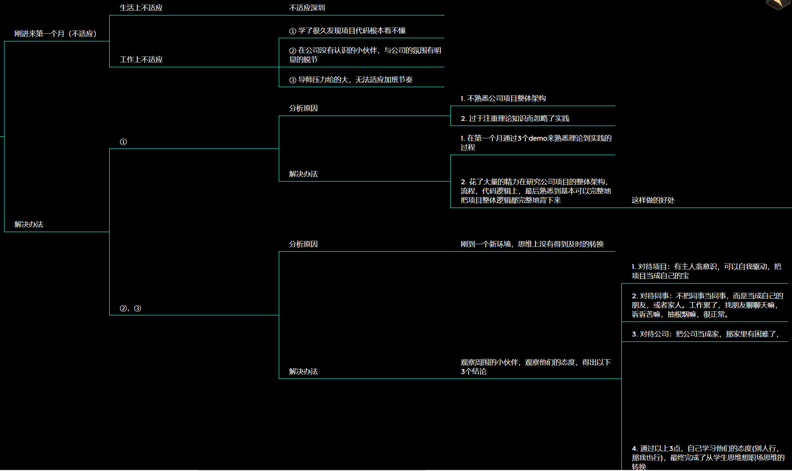
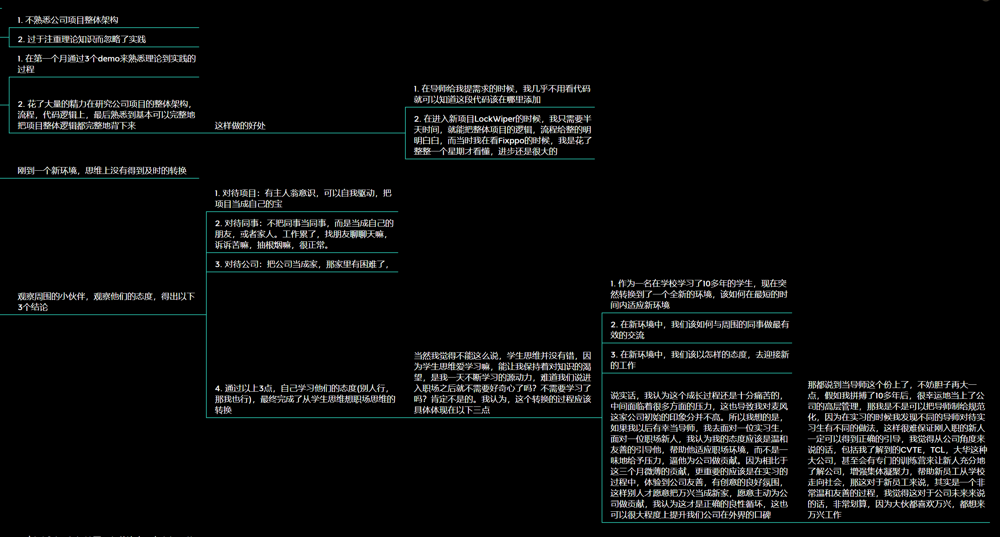
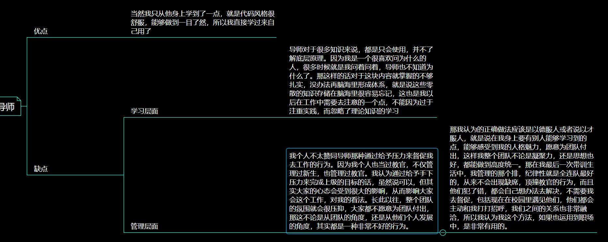

## 自我介绍

首先非常感谢之前的面试官和您愿意认可我的能力，愿意在百忙之中给予我面试的机会。我叫李沛，来自……

1. 学习能力强，学习强度大：在校学习期间多次取得优异成绩并获得校二等奖学金等荣誉。在麦风实习期间，每天工作学习时间至少9个小时以上，在下班回家的路上也不忘复盘白天的工作内容，在短短两个月的时间从c++新人成长为了具备初步开发能力的工程师。
2. 学习态度好，愿意接受新事物：在实习期间虚心接受导师和其他同事的意见，态度上完成了从学生思维向职场人的转换
3. 善于交际，不怕社死：在当军训教官的带训期间，积极与学院书记，学生会进行工作对接，在14天教官人手极度缺乏的情况下成功维持住了近千人军训场地的秩序，获得学院书记的高度评价。
4. 专业能力与公司岗位匹配度高：在了解万兴公司的产品过程中，下载了公司的多个热门产品进行体验，发现公司的部分产品与我在实习期间接触的内容高度重合，相信如果我有机会加入公司，只需要很短的时间了解公司的组件库即可上手实操，相比其他同学能更快地为公司创造价值。好的，谢谢面试官。

## 基础素质

### 选择C++的原因/成长经历

在6个月以前，也就是今年3月，看到23届同学们惨淡的毕业率之后，为了确定以后的工作方向，我做了一个小小的调查，我发现大部分公司的主流语言是java和C++，其他的还有类似产品经理，软件测试，等等，这些我觉得没啥技术难度，所以我直接忽略了，然后就是选择java和C++，这个问题我去问了问上个学期当校园大使的一些同学，了解到虽然java岗位多，而且我们学校主修的就是Java，但是非常卷，大部分企业秋招还没结束java岗位就已经饱和了，于是我顺理成章地选择了C++。但是在C++的学习过程中，我发现C++和java不同，C++有很多很多细分岗位，而且每个岗位所需要的专业知识差距非常大，而且都需要一定的学习成本，所以我仔细去了解了C++的不同岗位，并且顺便给自己提出了三个要求。第一个：必须是C++。第二个：必须保证未来的发展道路要广。第三个：选择的人少，这样加上我本来就强的学习能力，才更容易从众多面试者中脱颖而出。经过一段时间的了解，于是我就瞄准了Qt这个方向。当然也说了，Qt只是我入行C++的一个方式，如果以后真的能进入到万兴工作的话，我还是希望能参与到公司的底层开发，或者说核心功能的开发，我觉得这些业务才能够真正体现出自己的硬实力
### 准备面试的心路历程
其实我只参加过两场面试，一场是今年6月麦风的提前批，一场就是万兴的面试了，先说说麦风的吧，在参加麦风面试之前呢，其实我根本就不知道怎么去复习，我只知道他们说只要了解基础的C++语法就可以了，但是等我真正去参加面试的时候，我才发现除了C++基础语法，还有自我介绍，项目经验，数据结构，等等一些人文方面的问题，当时对于我来说还是挺考验临场反应的。但好在平时的基础很扎实，具备举一反三的能力，所以当时面试官给我评价还是很高的。不过一面结束之后我还是自己反思了一下，**总结了三点**。**第一点**是我发现虽然说面试的结果很好，但这个不确定性，也就是风险还是太高了不够稳定，对于这个问题的解决办法，我认为主要还是多看面经，了解面试的流程；**第二点**是我发现在面试考察C++的时候，虽然题都很八股，但是我不能回答的太八股，因为作为一名优秀的学生，和其他普通的学生相比，最大的不同点是知识点在我的脑海里是成体系存在的，也就是说只要问其中一点，欸我就可以把其他所有的点都答上来，包括他们的基本概念，注意事项，代码实现等等，这个在八股文里面其实是没有的，所以对于我来说，我更应该看重平时的一个积累，当然这对于我来说不需要注意，因为按照我自己的学习流程走下来的话，最后的效果就是这样的，只是说有则改之无则加勉吧；**第三点**是我在一面结束后，发现面试官问的问题有着很明显的区分度，我大体分成了三类，分别是考察学习能力，学习态度，交流能力。我想的是，如果我作为一个面试官，如果我想招人的话，那我考察的内容，肯定是公司最需要的能力，而在面试过程中，通过对面试官的表情，语气的观察，我发现我给面试官的态度其实是非常好的，说明我是具备这三个能力的，那我觉得要是我的优点正好是公司所需要的，那我为什么不直接一点，在自我介绍的时候就说出来呢，于是我马上就把自己的自我介绍给改了。在之后的麦风二面，以及万兴的一面，我都发现面试官其实都很明显地注意到了自我介绍的内容，说明我得出的这个结论，其实是非常有效的，我个人也比较满意。
那其实在万兴的一面之中，我和面试官分享了很多技术上的问题，我自己稍微总结了一下，选了两个我认为会对我理解项目或者说技术上有比较大帮助的点，**第一个**是架构模式，……当然这个我感觉其实是比较简单的，因为我本身就已经看了非常多的项目源码了，不止Fixppo和LockWiper，还有UltraRepair，Anyto等等，我对公司的项目整体结构其实已经非常熟练了，因为差不多都是一个框架，基本可以背下来，只是我不知道他叫啥名。**第二个**是万兴的自定义connect，面试官说connect他对于大型项目的编译速度有很大影响，那我觉得首先要搞自定义connect的话，首先要知道connect的底层实现原理以及为什么原生connect会拖累项目编译进度

### 为什么选择万兴

### C++学了多久了

光看时间的话，不久，但是我并不认为我属于速成那一类，因为在此之前我已经学了很多很多计算机知识，包括C语言，数据结构和算法，Java，前端，汇编，大数据，Linux，等等。对于我来说，我已经形成了基本的计算机思维，我的理解能力，对于新知识的接受能力，以及我自创的一个学习方法（接触新知识从他的基本概念，底层原理，注意事项，代码实践，运行逻辑等方面依次学习），所以我学起新知识本来就是很快，而且在学习的过程中为了防止遗忘，我还做了近2w字的笔记（有道云，markdown，另一台电脑，笔记本），让这些知识在我的脑海里成体系存在，也就是说只要问其中一点，欸我就可以把其他所有的点都答上来，包括他们的基本概念，注意事项，代码实现等等。

但在实习的过程中，我觉得更加重要的还是有两点，**第一点**是多实践，能够在真实的项目中去实践，改进自己的学习方法，扩充自己的知识库。第二点是多与大佬交流，在一面的时候，和面试官交流了非常非常多的技术问题，事后总结下来大概有10条吧，我选了两个我认为会对我理解项目或者说技术上有比较大帮助的点，第一个是架构模式，……当然这个我感觉其实是比较简单的，因为我本身就已经看了非常多的项目源码了，不止Fixppo和LockWiper，还有UltraRepair，Anyto等等，我对公司的项目整体结构其实已经非常熟练了，因为差不多都是一个框架，基本可以背下来，只是我不知道他叫啥名。**第二个**是万兴的自定义connect，面试官说connect他对于大型项目的编译速度有很大影响，那我觉得首先要搞自定义connect的话，首先要知道connect的底层实现原理以及为什么原生connect会拖累项目编译进度

### 实习的收获

 [实习收获.xmind](C:\Users\11582\Desktop\实习收获.xmind) 

### C++看过的书

在我刚开始学C++的时候，我买的是C++prime plus，了解C++的基本语法与书写规范，但是在实习了一个多月之后，我发现这本书已经不够用了，于是买了C++prime这本书，重点了解了C++新特性以及容器的一些基本概念，这个时候我发现一个问题，就是我了解的这些内容都属于理论性的知识，没办法直接应用到项目中，于是我又买了Qt5开发实例，但是我觉得这本书是不太适合我的，因为这本书的主要内容是在讲如何实践，但其实实践部分我看公司代码就可以了，我想了解的其实是库函数，功能函数这方面，这本讲的不是很全面，当然我还买了C++数据结构与算法，结合工作中的内容，我主要学习的是其中STL的实践部分以及底层原理。

但在实习的过程中，我觉得更加重要的还是有两点，**第一点**是多实践，能够在真实的项目中去实践，改进自己的学习方法，扩充自己的知识库。**第二点**是多与大佬交流，在一面的时候，和面试官交流了非常非常多的技术问题，事后总结下来大概有10条吧，我选了两个我认为会对我理解项目或者说技术上有比较大帮助的点，第一个是架构模式，……当然这个我感觉其实是比较简单的，因为我本身就已经看了非常多的项目源码了，不止Fixppo和LockWiper，还有UltraRepair，Anyto等等，我对公司的项目整体结构其实已经非常熟练了，因为差不多都是一个框架，基本可以背下来，只是我不知道他叫啥名。第二个是万兴的自定义connect，面试官说connect他对于大型项目的编译速度有很大影响，那我觉得首先要搞自定义connect的话，首先要知道connect的底层实现原理以及为什么原生connect会拖累项目编译进度

### 如何平衡工作与生活

我认为想要平衡工作与生活，首先要学会适应工作，这和学习何其相似！那适应工作的第一步，我认为是先确立好自己的目标，毕竟有目标才有动力，其次是学会找到自己的优点，因为适应的过程永远是痛苦的，我们往往会在这个过程中过于关注自己的不足而忽略了自己优点，最后是像周围优秀的人学习，因为他们已经是在职场打拼多年的老员工，对于工作有自己的看法，了解他们的生存之道对我而言会有很大帮助。而生活对我而言，往往是劳累一天之后的放松，在这个时间段听听歌，打打游戏，缓解一天的疲惫，让我能在第二天的工作中有着更高的付出回报比，从而形成良性循环

### 为什么不考研

在去年年底，其实我是准备考研的，但是我在准备考研的过程中，发现我在学习的过程中，会特别沉浸，特别注重理论的学习，而忽略了网上一些有价值的考研信息，那最后或许我能考的很好，但是可能由于最后和别人的一个信息差，我报考不了特别好的学校，所以我选择了对我来说付出回报比更大的找工作。

## 反问环节

1. https://articles.zsxq.com/id_0mmc47ppei94.html
2. 在看了空宣之后，了解到万兴最近在扩建，但我在秋招的过程中，我发现很多互联网大厂，像TCL，CVTE，大华，华为等，他们并不是纯粹做只做互联网的，他们主营的业务是硬件，只是在硬件的基础上，开发互联网产品，这样的话他们就会有一个非常稳定的业务来源，只做互联网产品的，像腾讯，网易等等，他们只做互联网的都已经有了自己非常稳定的用户群体，那对于万兴知名度最广的万兴喵影来说，不论是在国内还是国外，都有adobe全家桶作为替代，在这种情况下，是如何确保在未来一定有一个很大的发展空间的呢
3. 万兴喵影中的动态滑动效果是怎么实现的
4. 在投递其他大型公司的岗位时，我发现很多企业都会有专门的研究生，博士生投递入口，也有专门的研究院来保证公司的核心竞争力，但是在万兴的校招官网上，我并没有看到相关的投递入口，那万兴是怎样确保自己持续的创新，创意能力的呢
5. 在了解完公司的产品之后，我想象了一个场景，就是我拍完视频，回家发现视频坏了，然后我去百度搜”视频修复“，但是映入我眼帘的是知乎，bilibili，等一些其他软件的广告，而如果我想了解万兴的产品的话，要么我就得划到最下面，要么我就只能点进知乎的链接才能看到，就是说对于国内用户而言，了解到公司产品的途径还是比较有限的，那公司是通过什么样的途径来打响在国内的知名度的呢
6. 剪映跨平台广，和抖音有联动，与万兴喵影相比，万兴的优势在哪
7. 为什么最高月薪是1.9w，但是年薪是30w+？